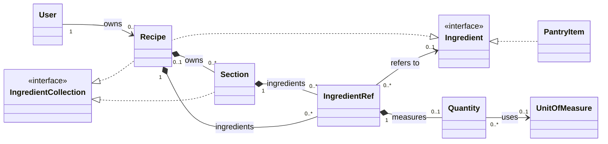
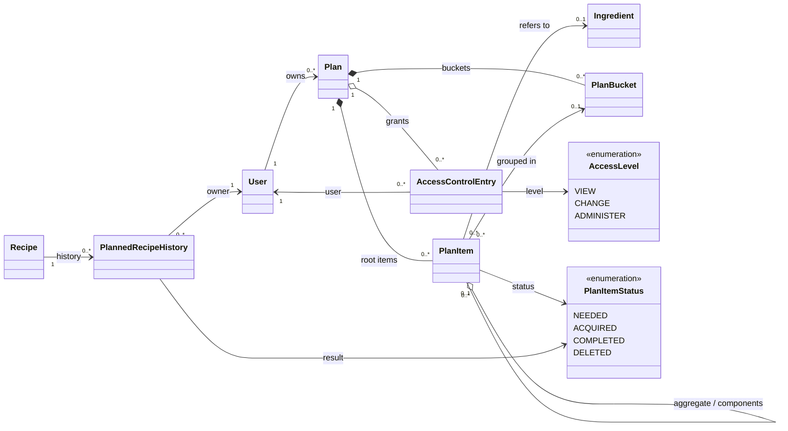
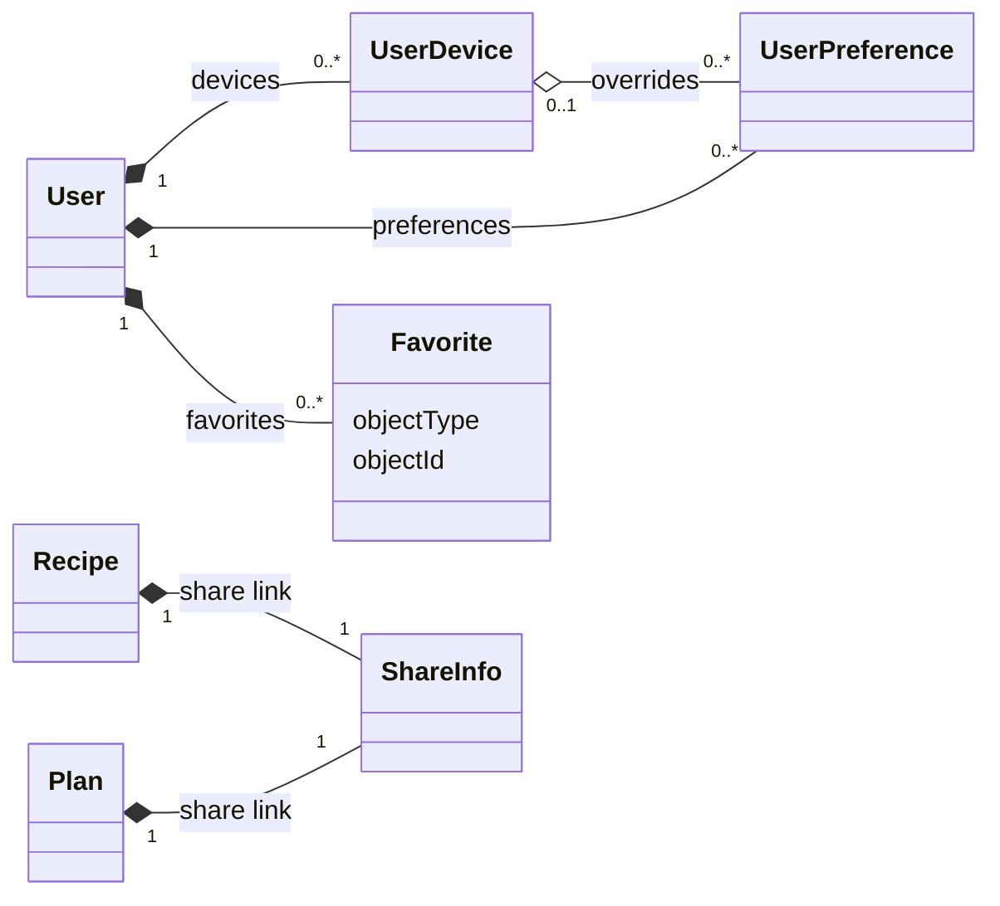

# Domain model

State: Agreed  
Source: [`schema.graphql`](../../schema.graphql)

This is a compact map of the types and relationships exposed by the GraphQL
schema. It leaves out queries, mutations, pagination, search inputs, file
uploads, and recognition results.

## Recipes and ingredients

Both recipes and pantry items are ingredients. This lets a recipe contain a
pantry item or another recipe through an ingredient reference. A section is a
named collection of ingredients and directions. A recipe may own a section or
refer to one owned elsewhere.

## Planning

A plan is the root of a tree of plan items. A plan item may also participate in
a separate aggregate/component relationship. Buckets group items within one
plan and may give that group a name and date.

The plan owner may grant one access level to each other user. Recipe history
records when a recipe was planned and finished, who owns that history entry,
and its resulting status.

## Accounts and preferences

A preference belongs to a user and may be specific to one device. When the
device-specific value is absent, the user-level value and then the static
default are used. Favorites point to their target by object type and ID.

## Rules not shown in the diagrams

- A plan is the root of its plan-item tree and cannot have a parent.
- Following a plan item's parents always leads to its plan.
- A plan item can only use a bucket from the same plan.
- Recipe sections and recipe ingredients are separate collections.
- An ingredient reference may remain as raw text when it has not been matched
  to an ingredient.
- A user's access grant is unique within a plan.
