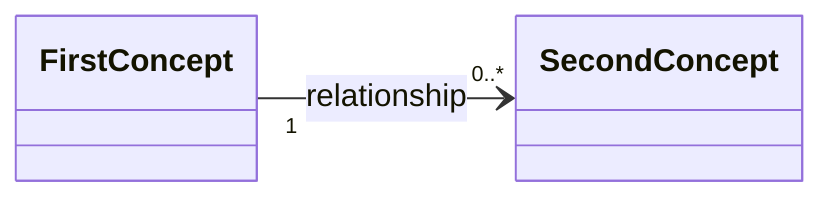

# Domain area

State: Draft

Explain what part of the product this diagram covers.

When the concepts are exposed by GraphQL, link to `schema.graphql` as the source
and leave query, mutation, pagination, and input types out of the diagram.

| Term | Meaning |
| --- | --- |
| First concept | Define only terms that need explanation. |

Rules the diagram does not show:

- State the conditions that must always hold.

## Questions

- Keep unresolved model questions here.
